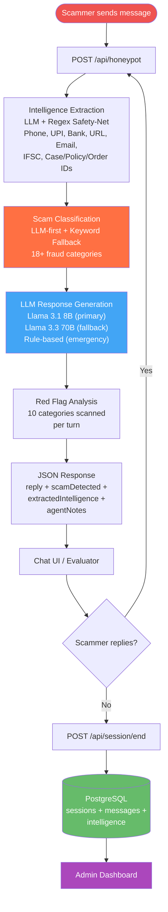

# Agentic Honeypot

An AI-powered scam detection honeypot that engages scammers in realistic conversation using LLM-driven personas, extracts intelligence (phone numbers, UPI IDs, bank accounts, URLs, emails, case/policy/order IDs), and provides comprehensive scam analysis — all through a single API endpoint.

---

## Description

This system acts as an **intelligent honeypot agent** designed to waste scammers' time while extracting actionable intelligence. When a scammer contacts the system, it responds as a realistic, trusting persona who gradually draws out the scammer's data — phone numbers, bank accounts, UPI IDs, phishing links — while keeping them engaged for as long as possible.

### Core Strategy

1. **Engagement-First Persona** — Plays a trusting, naive victim who cooperates eagerly, never suspects a scam, asks clarifying questions, and creates natural delays
2. **Dual Intelligence Extraction** — LLM extracts data as part of its JSON response, then a regex safety-net catches anything the LLM missed (especially structured data like phone numbers, IFSC codes, UPI IDs)
3. **Dynamic Red Flag Analysis** — Scans all conversation text against 10 categories of scam indicators (urgency tactics, OTP requests, authority impersonation, etc.)
4. **Hybrid Scam Classification** — LLM classifies scam type with keyword-based fallback supporting 18+ fraud categories
5. **Never-Fail Design** — Dual API key fallback → dual model fallback → rule-based response — the API always returns a valid response within 24 seconds

---

## Application Flow



---

## Features

- **Realistic AI Persona** — Engages scammers naturally with configurable name, age, occupation, location, bank, gender, and language
- **LLM-First with Rule-Based Fallback** — Primary response generation via LLM; 18 pre-written investigative fallback responses for complete LLM failure (all ending with questions for continued engagement)
- **Dual Intelligence Extraction** — LLM extracts 11 data types per turn; compiled regex safety-net catches anything missed; history re-extraction ensures no data loss on stateless platforms
- **18+ Scam Type Classifications** — `bank_fraud`, `upi_fraud`, `kyc_scam`, `otp_fraud`, `lottery_scam`, `job_scam`, `investment_scam`, `crypto_investment`, `threat_scam`, `phishing`, `tech_support`, `customs_fraud`, `insurance_fraud`, `electricity_scam`, `loan_approval`, `income_tax`, `govt_scheme`, `generic`
- **Dynamic Red Flag Engine** — 10 pattern categories scanned against all conversation text, reported with counts in agentNotes
- **AI Voice Detection** — Whisper STT transcription + heuristic analysis for AI-generated speech detection
- **Text-to-Speech** — ElevenLabs Turbo v2.5 with free voices (Rachel/Antoni)
- **PostgreSQL Persistence** — Optional session data storage with messages, intelligence, and timestamps
- **Admin Dashboard** — Real-time stats, session list with pagination, conversation replay, settings management
- **5-Level Fallback Chain** — 2 API keys × 2 models + rule-based = guaranteed response delivery within 24 seconds

---

## Tech Stack

| Component | Technology | Purpose |
|---|---|---|
| **Backend** | FastAPI 3.0 (Python 3.10+) | Async API with auto-validation and docs |
| **Primary LLM** | Groq — Llama 3.1 8B Instant | Fast conversation + classification (12s timeout) |
| **Fallback LLM** | Groq — Llama 3.3 70B Versatile | Higher quality fallback (8s timeout) |
| **TTS** | ElevenLabs — Turbo v2.5 | Text-to-speech with free voices (optional) |
| **STT** | Whisper Large v3 via Groq | Speech transcription for voice detection (optional) |
| **Database** | PostgreSQL + asyncpg | Session persistence and analytics (optional) |
| **Frontend** | Vanilla HTML/CSS/JS | Dark-theme chat UI and admin dashboard |
| **Deployment** | Vercel Serverless / Uvicorn | Serverless-compatible with local dev support |

---

## Setup & Running

### Prerequisites

- Python 3.10+
- Groq API key ([console.groq.com](https://console.groq.com))
- PostgreSQL 14+ (optional — for session persistence)
- ElevenLabs API key (optional — for voice features)

### 1. Clone the Repository

```bash
git clone https://github.com/yourusername/AGENTIC-POT.git
cd AGENTIC-POT
```

### 2. Install Dependencies

```bash
pip install -r requirements.txt
```

### 3. Configure Environment Variables

```bash
cp .env.example .env
```

Edit `.env` with your actual values:

```env
# REQUIRED
GROQ_API_KEY=your_groq_api_key_here

# OPTIONAL — second Groq key for rate limit fallback
RECOVERY_KEY=your_backup_groq_key_here

# OPTIONAL — API authentication
API_KEY=your_api_key_here

# OPTIONAL — PostgreSQL (for session persistence)
POSTGRES_HOST=localhost
POSTGRES_PORT=5432
POSTGRES_DB=honeypot
POSTGRES_USER=postgres
POSTGRES_PASSWORD=your_password_here

# OPTIONAL — ElevenLabs (for TTS)
ELEVENLABS_API_KEY=your_elevenlabs_key_here
```

See [.env.example](.env.example) for all available options.

### 4. Run the Server

```bash
python -m uvicorn api.index:app --host 0.0.0.0 --port 8001
```

### 5. Test the Endpoint

```bash
curl -X POST http://localhost:8001/api/honeypot \
  -H "Content-Type: application/json" \
  -H "X-API-Key: your_api_key_here" \
  -d '{
    "sessionId": "test-session-1",
    "message": {"sender": "scammer", "text": "Your bank account has been compromised!"},
    "conversationHistory": [],
    "metadata": {"channel": "SMS", "language": "English", "locale": "IN"}
  }'
```

### 6. Open in Browser

| URL | Description |
|---|---|
| `http://localhost:8001` | Chat UI |
| `http://localhost:8001/admin` | Admin Dashboard |
| `http://localhost:8001/health` | Health Check |

---

## API Endpoint

- **URL**: `POST /api/honeypot`
- **Authentication**: `X-API-Key` header (optional, configurable)

### Request Format

```json
{
  "sessionId": "uuid-v4-string",
  "message": {
    "sender": "scammer",
    "text": "URGENT: Your SBI account has been compromised...",
    "timestamp": "2026-02-11T10:30:00Z"
  },
  "conversationHistory": [
    {
      "sender": "scammer",
      "text": "Previous scammer message...",
      "timestamp": "1707645000000"
    },
    {
      "sender": "user",
      "text": "Previous honeypot response...",
      "timestamp": "1707645015000"
    }
  ],
  "metadata": {
    "channel": "SMS",
    "language": "English",
    "locale": "IN"
  }
}
```

### Response Format

```json
{
  "status": "success",
  "sessionId": "uuid-v4-string",
  "reply": "Oh no! What happened to my account? Can you tell me more?",
  "scamDetected": true,
  "scamType": "bank_fraud",
  "confidenceLevel": 0.85,
  "totalMessagesExchanged": 12,
  "engagementDurationSeconds": 300.0,
  "extractedIntelligence": {
    "phoneNumbers": ["+91-9876543210"],
    "bankAccounts": ["1234567890123456"],
    "upiIds": ["scammer@fakebank"],
    "phishingLinks": ["http://fake-site.com"],
    "emailAddresses": ["scam@fraud.com"],
    "caseIds": ["CASE-2026-78432"],
    "policyNumbers": ["POL-2026-ABC"],
    "orderNumbers": ["ORD-AMZ-2026-789"]
  },
  "engagementMetrics": {
    "engagementDurationSeconds": 300.0,
    "totalMessagesExchanged": 12
  },
  "agentNotes": "Scam type: bank_fraud (confidence: 0.85). Red flags identified (6): Urgency/time pressure tactics; Account block/freeze threat; ..."
}
```

---

## Approach

### How Scams Are Detected

The system uses a **hybrid classification** approach:

1. **LLM Classification** (primary): The Groq LLM classifies the scam type and confidence as part of its JSON response. It sees the conversation context and identifies the fraud category from 18+ types.

2. **Keyword-Based Classification** (fallback): When the LLM is unavailable (rate limits, timeouts), a rule-based classifier scans all conversation text against 150+ keywords across 18 scam categories (bank fraud, UPI fraud, phishing, KYC scam, lottery scam, job scam, crypto investment, tech support, customs fraud, insurance fraud, electricity scam, loan approval, income tax, government scheme, threat scam, etc.).

3. **Confidence Escalation**: Scam confidence increases monotonically — once detected, it never decreases.

### How Intelligence Is Extracted

**Dual-strategy extraction** ensures near-100% data capture:

1. **LLM Extraction**: The LLM extracts identifiable data from each scammer message into 11 typed arrays (phones, accounts, UPIs, URLs, emails, names, IFSC codes, case IDs, policy numbers, order numbers, other IDs).

2. **Regex Safety-Net**: Compiled regex patterns run on every message as a backup — catching phone numbers (including `+91` prefix), bank accounts (11-18 digits), UPI IDs (with sentence-boundary handling), URLs, emails, IFSC codes, and prefixed IDs (case/policy/order numbers with digit-verification to prevent false positives).

3. **History Re-extraction**: On every turn, the regex safety-net runs on the full conversation history — critical for serverless environments where in-memory state is lost between requests.

4. **Deduplication**: All extracted intelligence is deduplicated within each session by type + normalized value.

### How Engagement Is Maintained

The persona system keeps scammers engaged through multi-phase conversation strategy:

- **Turns 1-2**: Emotional reaction — surprise, worry, genuine concern
- **Turns 3-5**: Willing but confused — eager to help but needs clarification, asks for caller's details
- **Turns 6+**: Active cooperation — pretends to follow instructions while naturally extracting more data (UPI IDs, account numbers, reference numbers)

All responses end with exactly one question to keep the conversation flowing. The LLM prompt enforces this, and all 18 rule-based fallback responses also end with investigative questions.

### Red Flag Analysis

A dynamic analysis engine scans all scammer text against 10 red flag categories:

| Category | Pattern Examples |
|---|---|
| Urgency/time pressure | "immediately", "hurry", "expires", "act now" |
| OTP/credential request | "OTP", "password", "CVV", "verification code" |
| Account threats | "blocked", "frozen", "suspended", "restricted" |
| Legal/arrest threats | "arrest", "warrant", "CBI", "prosecution" |
| Too-good-to-be-true | "won", "prize", "guaranteed returns", "jackpot" |
| Suspicious links | "click here", "download", "verify link" |
| Sensitive data request | "share account", "send money", "provide details" |
| Unsolicited contact | "calling from", "this is from", "we have noticed" |
| Upfront fee demand | "processing fee", "advance payment", "service charge" |
| Authority impersonation | "from SBI", "from RBI", "officer", "department" |

Red flags are listed explicitly in `agentNotes` with counts and a natural-language description.

---

## Fallback Chain

The system implements a 5-level fallback chain to guarantee response delivery:

```
Level 1: Primary Key + Primary Model (llama-3.1-8b-instant, 12s timeout)
    ↓ failure
Level 2: Primary Key + Fallback Model (llama-3.3-70b-versatile, 8s timeout)
    ↓ failure
Level 3: Recovery Key + Primary Model (remaining budget)
    ↓ failure
Level 4: Recovery Key + Fallback Model (remaining budget)
    ↓ failure
Level 5: Rule-Based Response (instant, no API call)
         + Keyword Scam Classification
         + Regex Intelligence Extraction

Global timeout budget: 24 seconds (always responds within 30s API limit)
```

Even at Level 5 (complete LLM failure), the system still:
- Classifies scam types via keyword matching (18 categories)
- Extracts all intelligence via regex patterns
- Returns contextually appropriate responses (phase-aware: early/mid/late turns)
- Provides red flag analysis in agentNotes

---

## Environment Variables

| Variable | Required | Default | Description |
|---|---|---|---|
| `GROQ_API_KEY` | Yes | — | Groq API key for LLM and STT |
| `RECOVERY_KEY` | No | — | Backup Groq key for rate limit fallback |
| `API_KEY` | No | auto-generated | API authentication key |
| `LLM_MODEL` | No | `llama-3.1-8b-instant` | Primary Groq model |
| `LLM_FALLBACK_MODEL` | No | `llama-3.3-70b-versatile` | Fallback Groq model |
| `LLM_TIMEOUT` | No | `12` | Primary model timeout (seconds) |
| `ELEVENLABS_API_KEY` | No | — | ElevenLabs key for TTS |
| `POSTGRES_HOST` | No | `localhost` | PostgreSQL host |
| `POSTGRES_PORT` | No | `5432` | PostgreSQL port |
| `POSTGRES_DB` | No | `honeypot` | Database name |
| `POSTGRES_USER` | No | `postgres` | Database user |
| `POSTGRES_PASSWORD` | No | — | Database password |
| `PERSONA_NAME` | No | `Tejash S` | Default persona name |
| `PERSONA_AGE` | No | `28` | Default persona age |
| `PERSONA_OCCUPATION` | No | `Software Engineer` | Default persona occupation |
| `PERSONA_LOCATION` | No | `Perundurai` | Default persona location |

---

## All API Endpoints

| Method | Endpoint | Description |
|---|---|---|
| `POST` | `/api/honeypot` | Process scam message — returns reply + detection + intelligence |
| `POST` | `/api/voice/detect` | Upload audio file — detect AI-generated speech |
| `POST` | `/api/tts` | Text-to-speech conversion (ElevenLabs) |
| `POST` | `/api/session/end` | End session and persist to PostgreSQL |
| `GET` | `/api/admin/stats` | Dashboard statistics |
| `GET` | `/api/admin/sessions` | List sessions (paginated, filterable) |
| `GET` | `/api/admin/sessions/{id}` | Full session detail with messages and intel |
| `DELETE` | `/api/admin/sessions/{id}` | Delete a session |
| `GET` | `/api/admin/settings` | Get persisted settings |
| `PUT` | `/api/admin/settings` | Update a setting |
| `GET` | `/health` | Health check (server, Groq, database status) |
| `GET` | `/` | Serve chat UI |
| `GET` | `/admin` | Serve admin dashboard |

### Authentication

Protected endpoints accept an optional `X-API-Key` header:

```
X-API-Key: your_api_key_here
```

---

## Project Structure

```
AGENTIC-POT/
├── api/
│   └── index.py              # Self-contained FastAPI server (~1400 lines)
├── frontend/
│   ├── index.html            # Chat UI (dark theme, glass-morphism)
│   └── admin.html            # Admin dashboard (stats, sessions, settings)
├── docs/
│   └── ARCHITECTURE.md       # Architecture and technical documentation
├── .env.example              # Environment variable template
├── .gitignore                # Git exclusions
├── requirements.txt          # Python dependencies
├── vercel.json               # Vercel deployment configuration
└── README.md                 # This file
```

---

## Architecture

See [docs/ARCHITECTURE.md](docs/ARCHITECTURE.md) for detailed documentation including:
- System architecture overview
- Request processing pipeline
- Intelligence extraction strategy
- Fallback chain design
- Red flag analysis engine

---

## Deploy to Vercel

```bash
# 1. Push to GitHub
git push origin main

# 2. Go to vercel.com → Import repository

# 3. Set environment variables:
#    GROQ_API_KEY, API_KEY, RECOVERY_KEY (optional)
#    POSTGRES_* (optional, for persistence)

# 4. Deploy — the vercel.json is pre-configured
```

> **Note**: For Vercel, use a cloud-hosted PostgreSQL (Supabase, Neon, Railway) or omit database vars to run without persistence.

---

## License

MIT
