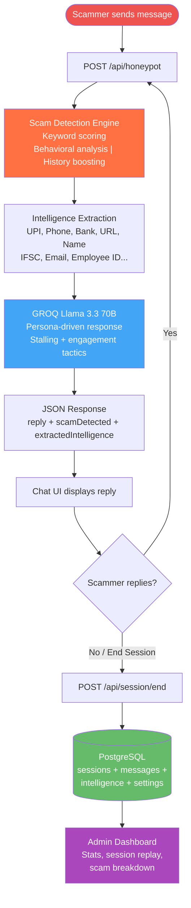

# Agentic Honeypot

An AI-powered scam detection honeypot that engages scammers using a realistic persona driven by GROQ's Llama 3.3 70B, extracts intelligence (UPI IDs, phone numbers, bank accounts), and persists sessions to PostgreSQL for analysis.

---

## Application Flow



---

## Features

- **Realistic AI Persona** — Engages scammers naturally via GROQ Llama 3.3 70B with configurable name, age, occupation, location, bank, gender, and language
- **Hybrid Scoring Model** — Pattern matching (45%) + keyword scoring (25%) + behavioral analysis (15%) + session history (15%), with urgency and multi-category boosters
- **Intelligence Extraction** — Automatically captures UPI IDs, phone numbers, bank accounts, URLs, names, IFSC codes, emails, employee IDs, reference IDs, policy IDs
- **12 Scam Type Classifications** — `bank_fraud`, `upi_fraud`, `kyc_scam`, `otp_fraud`, `lottery_scam`, `job_scam`, `investment_scam`, `threat_scam`, `phishing`, `tech_support`, `generic`
- **AI Voice Detection** — Whisper STT transcription + heuristic analysis for AI-generated speech detection
- **Text-to-Speech** — ElevenLabs Turbo v2.5 with free voices (Rachel/Antoni)
- **PostgreSQL Persistence** — Full session data with messages, intelligence, and timestamps
- **Admin Dashboard** — Real-time stats, session list with pagination, conversation replay, settings management
- **End Session** — Save and flush sessions to database with one click

---

## Tech Stack

| Component | Technology |
|-----------|-----------|
| Backend | FastAPI 3.0.0 (Python 3.10+) |
| LLM | GROQ — Llama 3.3 70B Versatile |
| TTS | ElevenLabs — Turbo v2.5 (free voices) |
| STT | Whisper Large v3 (via GROQ) |
| Database | PostgreSQL + asyncpg |
| Frontend | Vanilla HTML/CSS/JS (dark theme, glass-morphism) |
| Deployment | Vercel Serverless / Uvicorn standalone |

---

## Setup & Running

### Prerequisites

- Python 3.10+
- PostgreSQL 14+ (running on your machine or remote)
- GROQ API key ([console.groq.com](https://console.groq.com))
- ElevenLabs API key ([elevenlabs.io](https://elevenlabs.io)) — optional, for voice features

### 1. Clone the Repository

```bash
git clone https://github.com/your-username/AGENTIC-POT.git
cd AGENTIC-POT
```

### 2. Install Dependencies

```bash
pip install -r requirements.txt
```

### 3. Create PostgreSQL Database

```bash
# Connect to PostgreSQL (adjust host/port as needed)
psql -h localhost -p 5432 -U postgres

# In the psql shell:
CREATE DATABASE honeypot;
\q
```

> Tables are created automatically on first server startup.

### 4. Configure Environment Variables

```bash
cp .env.example .env
```

Edit `.env` with your actual values:

```env
# REQUIRED
GROQ_API_KEY=your_groq_api_key_here
ELEVENLABS_API_KEY=your_elevenlabs_api_key_here

# Server
HOST=0.0.0.0
PORT=8001
API_KEY=your_api_key_here

# PostgreSQL (REQUIRED)
POSTGRES_HOST=localhost
POSTGRES_PORT=5432
POSTGRES_DB=honeypot
POSTGRES_USER=postgres
POSTGRES_PASSWORD=your_password_here
```

See [.env.example](.env.example) for all available options.

### 5. Run the Server

```bash
python -m uvicorn api.index:app --host 0.0.0.0 --port 8001
```

### 6. Open in Browser

| URL | Description |
|-----|-------------|
| `http://localhost:8001` | Chat UI |
| `http://localhost:8001/admin` | Admin Dashboard |
| `http://localhost:8001/health` | Health check |

---

## Environment Variables

| Variable | Required | Default | Description |
|----------|----------|---------|-------------|
| `GROQ_API_KEY` | Yes | — | GROQ API key for LLM and STT |
| `ELEVENLABS_API_KEY` | No | — | ElevenLabs API key for TTS |
| `API_KEY` | No | `fae26946...` | API authentication key |
| `POSTGRES_HOST` | Yes | `localhost` | PostgreSQL host |
| `POSTGRES_PORT` | Yes | `5432` | PostgreSQL port |
| `POSTGRES_DB` | Yes | `honeypot` | Database name |
| `POSTGRES_USER` | Yes | `postgres` | Database user |
| `POSTGRES_PASSWORD` | Yes | — | Database password |
| `LLM_MODEL` | No | `llama-3.3-70b-versatile` | GROQ model name |
| `PERSONA_NAME` | No | `Tejash S` | Default persona name |
| `PERSONA_AGE` | No | `28` | Default persona age |
| `PERSONA_OCCUPATION` | No | `Software Engineer` | Default persona occupation |
| `PERSONA_LOCATION` | No | `Perundurai` | Default persona location |

---

## API Endpoints

| Method | Endpoint | Description |
|--------|----------|-------------|
| `POST` | `/api/honeypot` | Process scam message — returns reply + detection + intelligence |
| `POST` | `/api/voice/detect` | Upload audio file — detect AI-generated speech |
| `POST` | `/api/tts` | Text-to-speech conversion (ElevenLabs) |
| `POST` | `/api/session/end` | End session and persist to PostgreSQL |
| `GET` | `/api/admin/stats` | Dashboard statistics (totals, breakdown) |
| `GET` | `/api/admin/sessions` | List sessions (paginated, filterable) |
| `GET` | `/api/admin/sessions/{id}` | Full session detail with messages & intel |
| `DELETE` | `/api/admin/sessions/{id}` | Delete a session |
| `GET` | `/api/admin/settings` | Get persisted settings |
| `PUT` | `/api/admin/settings` | Update a setting |
| `GET` | `/health` | Health check (server, GROQ, DB status) |
| `GET` | `/` | Serve chat UI |
| `GET` | `/admin` | Serve admin dashboard |

### Authentication

Protected endpoints accept an optional `X-API-Key` header:

```
X-API-Key: your_api_key_here
```

---

## Project Structure

```
AGENTIC-POT/
├── api/
│   └── index.py              # Self-contained FastAPI server (~1220 lines)
├── frontend/
│   ├── index.html            # Chat UI (dark theme, glass-morphism)
│   └── admin.html            # Admin dashboard (stats, sessions, settings)
├── docs/
│   └── ARCHITECTURE.md       # Architecture diagrams & technical docs
├── .env.example              # Environment variable template
├── .gitignore                # Git exclusions
├── requirements.txt          # Python dependencies
├── vercel.json               # Vercel deployment configuration
└── README.md                 # This file
```

---

## Architecture

See [docs/ARCHITECTURE.md](docs/ARCHITECTURE.md) for detailed architecture diagrams including:
- System architecture overview
- Data flow sequence diagram
- Database ER diagram
- Scam detection scoring model
- Technology stack breakdown
- Security considerations

---

## Deploy to Vercel

```bash
# 1. Push to GitHub
# 2. Go to vercel.com → Import repository
# 3. Set environment variables: GROQ_API_KEY, API_KEY, ELEVENLABS_API_KEY, POSTGRES_*
# 4. Deploy
```

> **Note**: For Vercel deployment, you'll need a cloud-hosted PostgreSQL instance (e.g., Supabase, Neon, Railway).

---

## License

MIT
