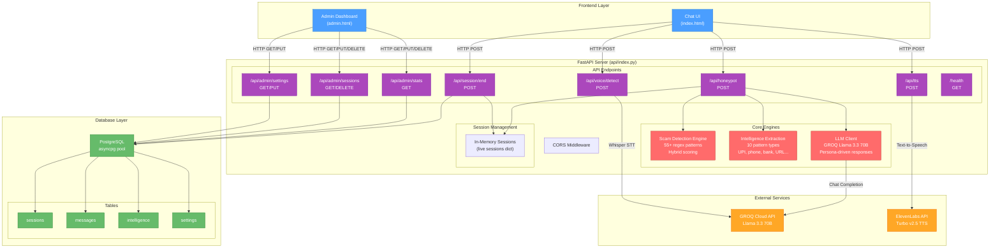
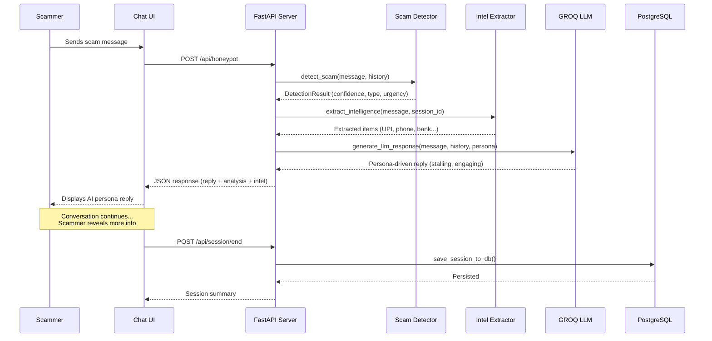
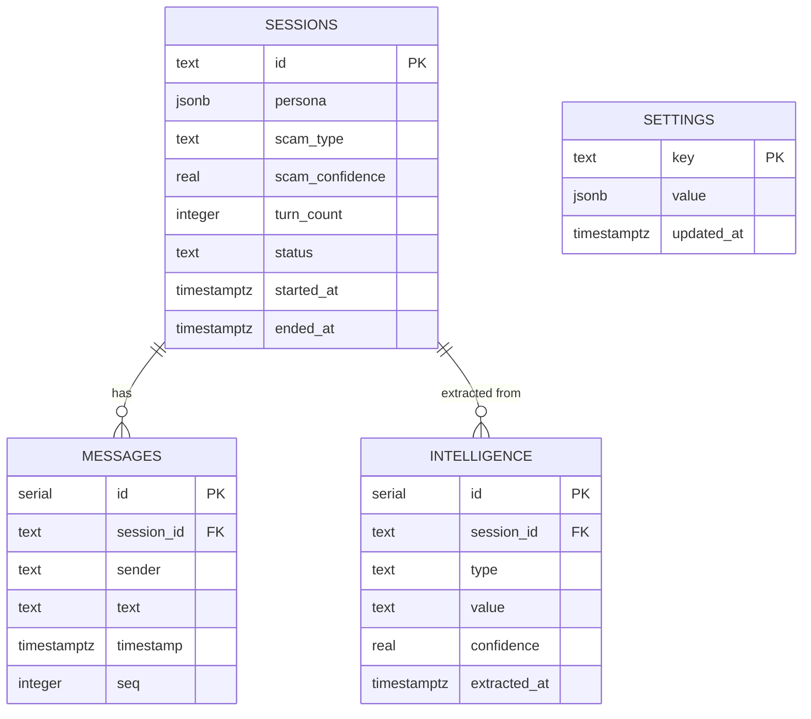
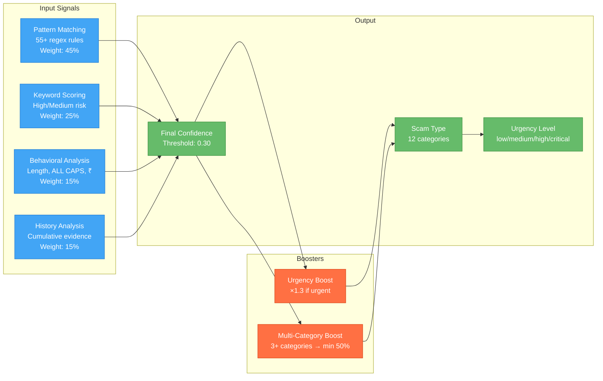

# Agentic Honeypot — Architecture Documentation

## System Architecture



---

## Data Flow — Scam Interaction Pipeline



---

## Database Schema (ER Diagram)



---

## Scam Detection Scoring Model



---

## Folder Structure

```
AGENTIC-POT/
├── api/
│   └── index.py          # Self-contained FastAPI server (~1200 lines)
├── frontend/
│   ├── index.html         # Chat UI (dark theme, glass-morphism)
│   └── admin.html         # Admin dashboard (stats, sessions, settings)
├── docs/
│   └── ARCHITECTURE.md    # This file
├── .env                   # Environment variables (git-ignored)
├── .env.example           # Template for .env
├── .gitignore             # Git exclusions
├── requirements.txt       # Python dependencies
├── vercel.json            # Vercel deployment config
└── README.md              # Project documentation
```

---

## Technology Stack

| Layer | Technology | Purpose |
|-------|-----------|---------|
| **Backend** | FastAPI 3.0.0 | Async Python web framework |
| **LLM** | GROQ (Llama 3.3 70B) | AI persona response generation |
| **TTS** | ElevenLabs (Turbo v2.5) | Text-to-speech for voice mode |
| **STT** | Whisper Large v3 (via GROQ) | Speech-to-text for voice input |
| **Database** | PostgreSQL + asyncpg | Session persistence & analytics |
| **Frontend** | Vanilla HTML/CSS/JS | Zero-dependency chat & admin UI |
| **Deployment** | Vercel / Uvicorn | Serverless or standalone hosting |

---

## Security Considerations

- **API Key Auth**: Optional header-based authentication (`X-API-Key`)
- **CORS**: Currently `allow_origins=["*"]` for development — restrict in production
- **DB Credentials**: Stored in `.env` (git-ignored), never hardcoded
- **JSONB Sanitization**: All persona/settings data serialized via `json.dumps()` before DB insert
- **Memory Bounds**: `_seen_intel` dict capped at 500 sessions to prevent unbounded growth
- **Input Validation**: Pydantic models enforce request schema
- **No Real Secrets Exposed**: The honeypot persona never reveals it's an AI or investigation tool
